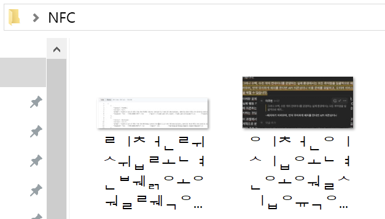
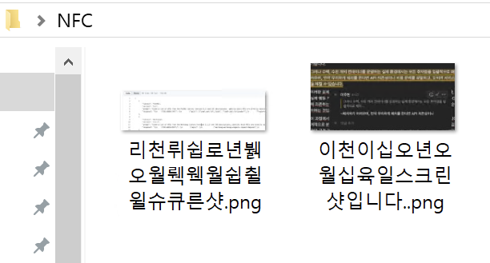

# 맥 → 윈도우 한글 깨짐 방지
NFD → NFC 변환 스크립트 (For MacOS)

## 개요
* macOS(APFS/HFS+)는 파일명을 NFD로 저장
* Windows(NTFS)는 NFC이므로 파일 전송시 한글이 자모 단위로 분리된다.
* `nfd2nfc.sh`는 지정한 디렉터리를 ZIP으로 압축하면서 모든 경로를 NFC로 정규화하고 `.DS_Store` 파일을 제거한다.

## 요구 사항
* macOS
* bash
* Python 3

## 사용법
```bash
bash nfd2nfc_zip.sh <대상경로> [출력.zip]
```

* `대상경로` 생략 시 현재 디렉터리.
* `출력.zip` 생략 시 `<대상경로 basename>.zip`.

예시
``` bash
sh nfd2nfc.sh /Users/pwned/Desktop/NFC
```

## 결과물

| 기존 macOS→Windows | 스크립트 사용 후 ZIP 해제 |
| ---  | --- |
|  |  |
